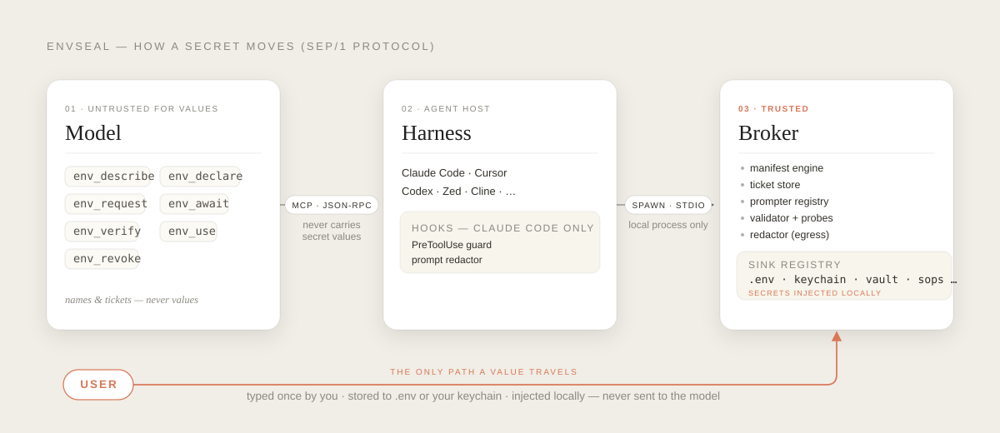

# envseal

[](https://www.npmjs.com/package/@envseal/cli)
[](https://docs.npmjs.com/generating-provenance-statements)
[](https://github.com/NDilanka/envseal/actions/workflows/ci.yml)
[](LICENSE)

**Your coding agent can ask for an API key without ever seeing it.**

envseal is a protocol (SEP/1) and local broker for safely provisioning secrets to AI coding agents. The agent declares what it needs, the user provides it through a secure local interface, and the value is written to `.env` or a keychain — never passed through the model's transcript.

## The problem

When an AI agent needs an API key, the standard flow is: "Please add `OPENAI_API_KEY=sk-...` to your `.env` and let me know." This forces a choice:

- **Paste into chat:** The key is now in the conversation transcript. That transcript is sent to the model provider, retained in server logs, persisted to session files, and replayed into context on every subsequent turn. One paste produces an unbounded number of copies across systems the user does not control. The key must be rotated immediately, and most users do not realize this.
- **Edit by hand:** Safe, but the agent loses the thread. It cannot confirm the key was actually added, validate its format, verify it works, or guide the user to the right provider.

There is currently no standard mechanism for an agent to say *"I need a value I am not allowed to see"* and have that resolve safely.

## How it works

The protocol splits the problem into four principals, each with a specific trust level:

<p align="center">
  
</p>

`*` keychain stores AND resolves values today (Windows DPAPI blob, macOS `security`, Linux `secret-tool`). `†` vault, 1Password, Doppler, and SOPS are implemented too — each delegates to its provider CLI (`vault`, `op`, `doppler`, `sops`), so a sink reports itself unavailable until that CLI is installed and authenticated. `dotenv`, `keychain`, and all four provider sinks both store and resolve values.

**The one rule:** The secret value travels `User → secure input surface → broker → sink (.env / keychain / vault / sops / …)` and crosses no other boundary. The model and harness can only see key names, declarations, tickets, and redacted status metadata.

The agent's verbs are strictly declarative:
- **`env_declare`** — "This project needs `OPENAI_API_KEY`, here's the format and provider."
- **`env_request`** — "Please collect these keys from the user."
- **`env_await`** — "When the user is done, tell me the outcome (stored, cancelled, invalid format)."
- **`env_verify`** — "Test the key by making a network call to the provider."
- **`env_use`** — "Run this command with the keys injected."

The model never constructs a value, never reads one back, and cannot receive one. Safety is structural, not policed.

> The hooks row applies to **Claude Code only**. Every other host gets the
> protocol (the model still cannot see a value), but nothing intercepts a shell
> command that reads `.env`. **Cursor, Aider, and Continue are Tier B** — advisory
> rules only, not enforced hooks. `envseal doctor` reports the real tier for your
> host — and reports tier B, not A, when the Claude Code plugin is not actually
> installed.

## Install

```bash
npm install -D @envseal/cli
npx envseal init
```

Every `@envseal/*` package ships with [npm provenance](https://docs.npmjs.com/generating-provenance-statements) (SLSA v1): the tarball is cryptographically attested to have been built by GitHub Actions in this repository, verifiable on each package's npm page.

Build from source instead:

```bash
git clone https://github.com/NDilanka/envseal && cd envseal
pnpm install && pnpm build

# then, from your own project:
node /path/to/envseal/packages/cli/dist/bin.js init
node /path/to/envseal/packages/cli/dist/bin.js ensure
```

For a runnable walk-through of the whole lifecycle (`init` → `ensure --check` → `set` → `run` → `status`), see [examples/demo](examples/demo/README.md) — CI executes that exact flow on every push.

`init` scans your source for environment-variable references and writes `env.schema.jsonc`, filling in provider metadata for keys it recognises. `ensure` then prompts for anything missing, in one pass. Values go to `.env` by default (after checking `.gitignore` covers it and git is not already tracking it), or to your OS keychain with `sink: "keychain"` — keychain-stored values are resolved by `envseal run` like dotenv ones, while keeping the plaintext out of the project directory.

## Connect your agent

Provisioning keys is only half of it: your agent asks for them through the broker, so the host has to be able to start the broker. For Claude Code, create `.mcp.json` at the project root:

```json
{
  "mcpServers": {
    "envseal-mcp": { "command": "envseal-mcp", "args": [] }
  }
}
```

Restart Claude Code afterwards. Copy-pasteable snippets for Cursor, Zed, Codex, Continue and the other hosts are in [docs/hosts/README.md](docs/hosts/README.md); installing the bundled plugin in `plugins/claude-code` on top of the MCP server is what earns tier A.

## Works with any agent

One protocol, four independent transport bindings. A host needs only one:

| Tier | Transport | Hosts | Requirement |
|---|---|---|---|
| **1. MCP** | stdio only (HTTP is a separate binding: `@envseal/http-server`, which speaks REST + OpenAPI, not MCP) | Claude Code, Codex, Cursor, Windsurf, Cline, Roo, Zed, Continue, Amp, Goose, Kilo, JetBrains AI, Copilot Agent (MCP), OpenAI Agents SDK, LangGraph/CrewAI via MCP client | MCP tool calling |
| **2. Native SDK** | in-process import or HTTP | Any agent on OpenAI, Anthropic, Gemini, Bedrock SDKs; LangChain, LlamaIndex, Vercel AI SDK | Register a tool |
| **3. Local HTTP** | `127.0.0.1` REST + token auth | Agents in Python, Go, Rust, or any language that can HTTP | Make an HTTP request |
| **4. CLI** | `envseal` subcommands, JSON output, exit codes | Any agent (Aider, OpenHands, bash loops, shell-only runners) | Run a command |

Tier 4 makes the claim "works with any agent" true rather than aspirational: an agent that can only shell out can still provision secrets safely. For that agent, [docs/cli-contract.md](docs/cli-contract.md) is the machine contract: exit codes, JSON shapes, and how setting `CI` switches every command to headless behaviour. For pipelines specifically, [docs/ci.md](docs/ci.md) covers the provisioning-vs-consumption model, the `envseal ensure --check` gate, and the exact scope of `ENVSEAL_ASSUME_YES`.

## Protection tiers

envseal offers different levels of protection depending on your host. `envseal doctor` reports which tier you have:

- **Tier A** — Full protocol + interception hooks. Claude Code **with the envseal plugin installed**. Model tool calls and user messages are pre-filtered to prevent accidental exfiltration. **Recommended.** Running under Claude Code without the plugin reports tier B, not A — `doctor` checks for the hook wiring rather than assuming it.
- **Tier B** — Protocol + advisory guardrails (rules files, pre-commit hooks, Continue contexts). Leak-through-shell is possible; recommend the `keychain` sink so `.env` holds nothing at all — it stores and resolves values, keeping plaintext out of the project directory.
- **Tier C** — Protocol only. Same recommendation, stated more plainly.

**On Tier B and C, a shell command can still exfiltrate a value.** The broker requires confirmation for every command and adds a network egress warning when the command can reach the network, but a user who clicks through defeats the control. This is not a limitation of the system; it is inherent to any tool that lets an agent execute arbitrary code. envseal's guarantees are structural at the protocol level — the model cannot obtain a value through the protocol itself — but the user remains responsible for what code they approve.

## How envseal compares

The pitch in one line: **bring your existing backend, gain transcript-blindness.** envseal is not another vault — it sits in front of the store you already run (`.env`, OS keychain, Vault, 1Password, Doppler, SOPS) and adds the piece none of them have: a protocol under which the agent provisions and uses secrets without the value ever crossing its transcript.

|  | envseal | dotenvx / dotenv-vault | teller | aws-vault |
|---|---|---|---|---|
| **Value crosses the agent's transcript?** | No — structurally; there is no protocol verb whose result carries a value | Yes if the agent reads the decrypted env | Yes — plaintext lands in process env | Yes (AWS creds in env) |
| **Per-use consent for injection** | Every `env_use` command is confirmed, with the full command and a network-egress warning shown | — | — | — |
| **Post-hoc redaction** | stdout/stderr of injected commands are redacted of secret substrings | — | — | — |
| **Backends** | dotenv, OS keychain, Vault, 1Password, Doppler, SOPS | its own encrypted `.env` | 30+ providers → env/file | AWS only |
| **What it manages** | the agent↔secret boundary | file encryption at rest | dev-time aggregation | IAM credential sessions |

dotenvx encrypts well at rest, teller aggregates broadly, aws-vault manages AWS sessions expertly — none of them address the moment an AI agent goes to *use* a secret, which is exactly the moment envseal owns: the value travels `user → secure input surface → broker → sink` and the model sees names, tickets, and redacted status, nothing else.

## What the model can and cannot do

The seven tools:

1. **`env_describe()`** — Read-only status of all keys (present/missing, format-valid, last verified). Never returns values. No flag or debug mode makes it do so.
2. **`env_declare(entries)`** — Tell the broker which keys the project needs, with format validation and provider metadata. Input is strictly rejected if it contains a value-shaped field.
3. **`env_request(keys, reason)`** — Ask the user to provide the named keys via a secure browser or native dialog. Returns immediately with a ticket ID and nonce.
4. **`env_await(ticket)`** — Block up to 90 seconds for the user to finish. Returns per-key outcome (stored, skipped, cancelled, invalid_format, verify_failed, timeout).
5. **`env_verify(keys)`** — Test a key by calling the provider's authentication endpoint. Returns classified result (ok, auth_failed, rate_limited, etc.) without showing upstream response bodies.
6. **`env_use(keys, command)`** — Run a shell command with the keys injected into the child environment only. stdout/stderr are redacted. Refuses with `SEP_NOT_DECLARED` or `SEP_KEYS_MISSING` if any requested key is not declared or not stored — no partial injection. Every command requires confirmation; commands with detected network egress add an explicit warning on top.
7. **`env_revoke(key)`** — Remove a key from the sink after user confirmation (MCP, SDK, HTTP, and CLI) and report the provider's rotation URL so the model can tell the user where to invalidate it.

**There is no tool, flag, debug mode, or environment variable that returns a secret value from any of these operations.** Not in normal mode, verbose mode, dry-run, or in error paths.

This holds by construction rather than by convention: the model's verbs are declarative, so there is no operation whose result type carries a value. It is checked rather than assumed — a test spawns the real MCP server as a child process, drives a full provisioning flow over stdio, records every byte in both directions including stderr, and asserts a sentinel secret appears nowhere while the flow demonstrably completed. Types alone are not the guarantee; during development this codebase typechecked cleanly while shipping a server that could not start.

## Security

- **[SECURITY.md](SECURITY.md)** — Supported versions and vulnerability reporting.
- **[docs/threat-model.md](docs/threat-model.md)** — Detailed threat and mitigation analysis.
- **[docs/residual-risks.md](docs/residual-risks.md)** — Nine risks that remain even with the protocol in place.
- **[docs/ci.md](docs/ci.md)** — Using envseal on runners: the `ensure --check` gate, `ENVSEAL_ASSUME_YES`, and what stays outside envseal's boundary in CI.

Read the residual risks section. No tool that handles secrets is risk-free, and this one makes no exceptions for marketing.

## Status

**Pre-1.0.** The protocol is complete and implemented. The design is stable. Feedback on the API surface, host integrations, and threat model is wanted. Expect the protocol to remain compatible once 1.0 ships; minor schema additions will follow the semver policy.

## License

Apache-2.0. See [LICENSE](LICENSE).
